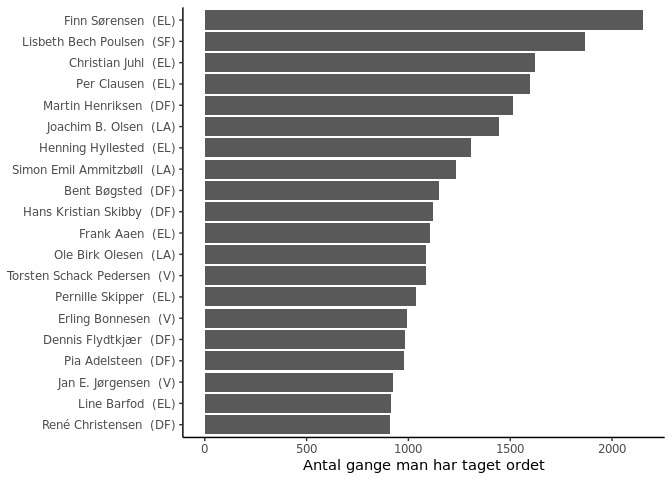
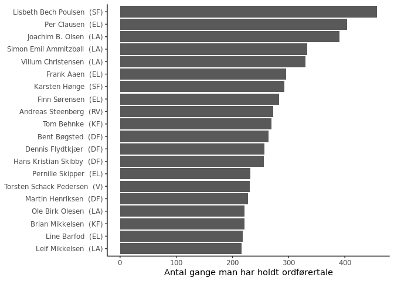

<!-- README.md is generated from README.Rmd. Please edit that file -->
FTreferateR
===========

<!-- badges: start -->
<!-- badges: end -->
The goal of FTreferateR is to provide an R package that collects and parse minutes from the Danish Parliament.

Installation
------------

<!--You can install the released version of FTreferateR from [CRAN](https://CRAN.R-project.org) with:

``` r
install.packages("FTreferateR")
```-->
You can install the development version from [GitHub](https://github.com/) with:

``` r
# install.packages("devtools")
devtools::install_github("emillykkejensen/FTreferateR")
```

Example
-------

This is a basic example which shows you how to get a list of all available parliamentary sessions, use that list to get a list of all meetings in that session and then get the data for all those meetings as a list of data.tables.

``` r
library(FTreferateR)

# Get a list of all available parliamentary sessions
FT_sessions <- getList_Session()

# Get a list of all meetings in that session
FT_meetings <- getList_Meeting(FT_sessions[3])

# Return the parsed meeting minutes as a list of data.tables
FT_data <- get_MeetingData(FT_meetings, verbose = TRUE)
#> (1/2) 20102_M1_helemoedet - download and parse XML data - convert xml data to R-like list - parsing data to nested data.table
#> (2/2) 20102_M2_helemoedet - download and parse XML data - convert xml data to R-like list - parsing data to nested data.table
```

### I need it all

The above code, only returns data for one session. If you wish to get all the available data run the code below - however note, that it will take some time ~2 hours.

``` r
library(magrittr)

FT_data <- 
  getList_Session() %>%
  getList_Meeting() %>%
  get_MeetingData()
```

### Then go explore the data!

``` r
library(data.table)
library(ggplot2)

Aktivitet <- FT_data$Aktivitet

ggplot(Aktivitet[OratorRole == "medlem", 
                 .(.N), by = "TalerTitel"][order(-N)][1:20]) +
  geom_col(aes(x = reorder(TalerTitel, N), y = N)) +
  coord_flip() +
  theme_classic() +
  labs(x = NULL, y = "Antal gange man har taget ordet")
```



``` r

ggplot(Aktivitet[OratorRole == "medlem" & 
                   TaleType %like% "Ordfører",
                 .(.N), by = "TalerTitel"][order(-N)][1:20]) +
  geom_col(aes(x = reorder(TalerTitel, N), y = N)) +
  coord_flip() +
  theme_classic() +
  labs(x = NULL, y = "Antal gange man har holdt ordførertale")
```


